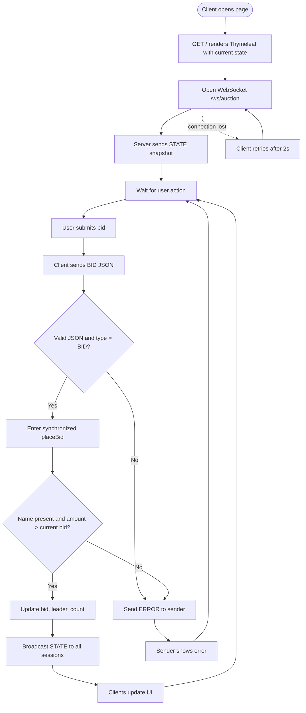
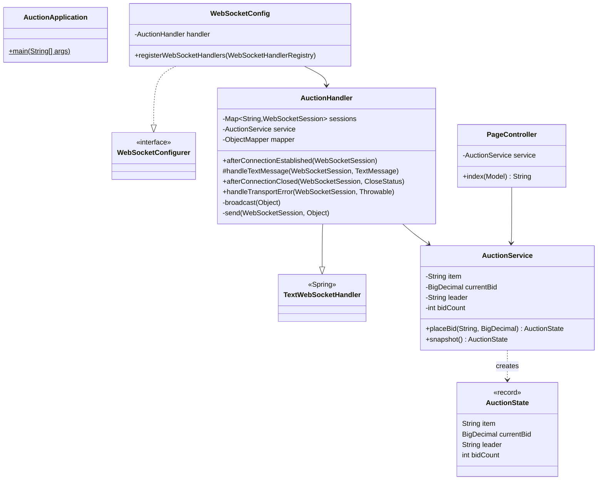
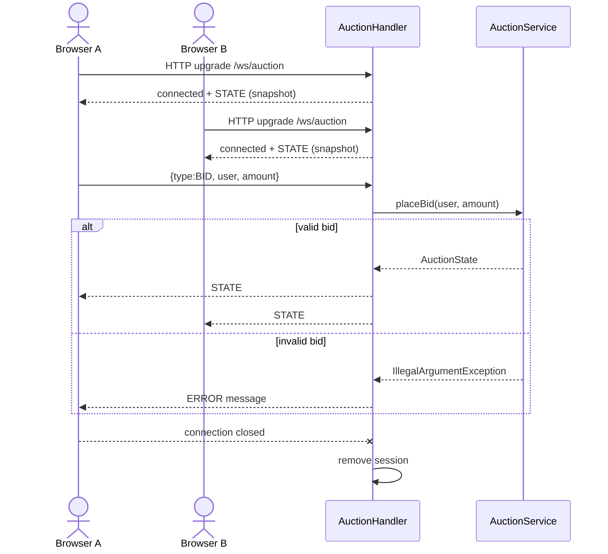
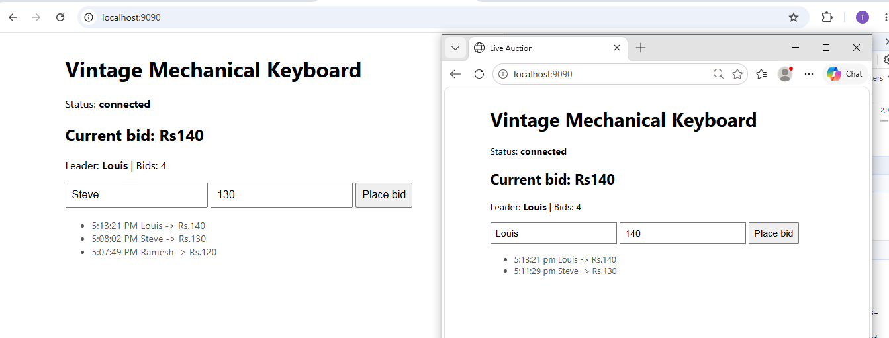

# Live Auction: Raw WebSocket Demo

A real-time auction built with **Java 17, Spring Boot 3, Spring WebSocket (raw, no STOMP) and Thymeleaf**.
Every open browser sees new bids instantly, with no page refresh.

  

---

## 1. What is WebSocket?

WebSocket is a protocol (RFC 6455) that gives a **persistent, full-duplex (two-way) connection** between a browser and a server over a single TCP connection.

| | HTTP (request/response) | WebSocket |
|---|---|---|
| Connection | New request each time | One long-lived connection |
| Who starts a message | Client only | Client **or** server |
| Overhead | Headers on every request | Small frames after the handshake |
| Typical use | Pages, REST APIs | Chat, live prices, notifications, games |

**How it works:** the client sends a normal HTTP request with `Upgrade: websocket`. The server replies `101 Switching Protocols`, and from then on both sides exchange messages freely until one closes the connection.

---

## 2. What is this project for?

A learning and reference project that shows how to build a **real-time, multi-user feature with raw WebSocket in Spring Boot**, with no STOMP and no external broker.

- Several users open the auction page and place bids.
- The server validates each bid and **broadcasts** the new state to every connected client.
- Invalid bids (low amount, missing name) return an error **only to the sender**.

**Key points demonstrated**
- A custom `TextWebSocketHandler` with a JSON message protocol (`BID`, `STATE`, `ERROR`)
- A session registry and broadcasting
- Thread-safe sends with `ConcurrentWebSocketSessionDecorator`
- Concurrency-safe bidding (`synchronized` service, covered by a 200-thread unit test)
- Automatic client reconnect
- Thymeleaf for the initial server-side render, with live updates over WebSocket

A STOMP version of the same app is available as a companion project (`auction-stomp`).

---

## 3. Activity Diagram



---

## 4. Class Diagram



---

## 5. Sequence Diagram



---

## 6. Output

Two browser windows (Chrome and Edge) connected to the same auction. Both show the same live state: current bid **Rs.140**, leader **Louis**, **4 bids**, and a bid history that updates in real time.



---

## 7. Message Protocol

| Direction | Message |
|---|---|
| Client to server | `{"type":"BID","user":"Louis","amount":"140"}` |
| Server to all clients | `{"type":"STATE","data":{"item":"...","currentBid":140,"leader":"Louis","bidCount":4}}` |
| Server to sender only | `{"type":"ERROR","message":"Bid must be higher than 140"}` |

---

## 8. Run It

**Requirements:** JDK 17, Maven 3.8+

```bash
mvn test              # run unit tests
mvn spring-boot:run   # start the app
```

Open **http://localhost:9090** in two browser windows and place bids.
Change the port in `src/main/resources/application.properties` (`server.port`).

## 9. Project Structure

```
src/main/java/com/example/auction/raw
  AuctionApplication.java   Spring Boot entry point
  WebSocketConfig.java      Registers the handler at /ws/auction
  AuctionHandler.java       WebSocket protocol, sessions, broadcast
  AuctionService.java       Bidding rules (thread-safe)
  AuctionState.java         Immutable state record
  PageController.java       Renders the Thymeleaf page
src/main/resources/templates/index.html   UI and WebSocket client
```

## 10. Limitations and Next Steps

- State is **in memory** and a single instance only. Use a database plus Redis pub/sub to scale out.
- No authentication yet. Add a JWT check with a `HandshakeInterceptor`.
- Single hard-coded item and no auction end time.
- Possible additions: integration tests with `StandardWebSocketClient`, Micrometer metrics, a Dockerfile and CI.
